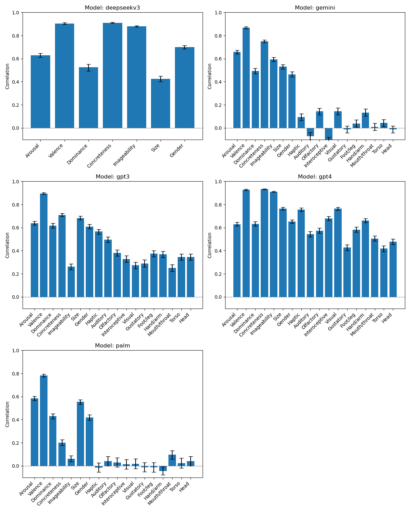

# Language Models and grounding
## Overview
This repository provides a framework for evaluating the alignment of conceptual representation between Large Language Models (LLMs) and humans, based on the findings from the paper Large Language Models without Grounding Recover Non-Sensorimotor but Not Sensorimotor Features of Human Concepts (Accepted). Our analysis investigates how well LLMs capture different dimensions of human conceptual knowledge, distinguishing between non-sensorimotor, sensory, and motor domains.

## Key Features
- Reproducible Evaluation Pipeline: We provide a Python-based pipeline that enables researchers to systematically assess various LLMs on their conceptual grounding.
- Continuous Updates: As new models emerge, we will continue updating the repository to keep it relevant for the research community.
- Recent Analysis: We have recently evaluated DeepSeek, a new LLM that has gained significant attention, using our pipeline. The results were consistent with our previous findings on ChatGPT and Google LLMs. The evaluation is included in the repository as an example.
- Dimension-wise Analysis: The repository currently supports a dimension-wise analysis of conceptual representations in LLMs.

## Current progress



## How to use the pipeline
**We welcome contributions from the research community!** <br>
There are two ways to use the pipeline. One option is to contribute to the current progress by submitting your model files in the required format (see Model responses). If you're willing to submit your model files to us and make your results publicly visible, we can run the evaluations for you and include your model’s evaluation results in the Current Progress section, with proper credit for your contribution.<br>

Alternatively, you can clone the repository, follow the steps below, and run the evaluations independently.

**Python version**: 3.11.7<br>
**Dependencies**:  Ensure you have the required packages installed by running:
  ```bash
  pip install -r requirements.txt
  ```

## Usage
To run the dimension-wise analysis, execute the following command:
```bash
python scripts/aggregated.py \
  --human_aggregated_directory scripts/example_files/human \
  --model_directory scripts/example_files/model \
  --output_path test_output.csv
```
### Human data
The pipeline uses word-level human data
- For the Glasgow norms, the word-level data is accessible at [https://doi.org/10.3758/s13428-018-1099-3].
- For the Lancaster norms, the word-level data is accessible at [https://embodiedcognitionlab.shinyapps.io/sensorimotor_norms/]
- Make sure that in the directory pointing to human data, **the Glasgow norms should be renamed to glasgow_human.csv and the Lancaster norms should be renamed to lancaster_human.csv.**
### Model responses
- Model responses should be organized into separate CSV files, with one file per model. Glasgow and Lancaster responses should be saved in separate files.
- **File names must follow the format {dataset}_{model}.csv**, where dataset should be either *glasgow* or *lancaster*, and model should be the name of your model.
- Please refer to example_files/model for example files.

### Arguments
--human_aggregated_directory: Directory containing human-annotated concept data.<br>
--model_directory: Directory containing model-generated representations.<br>
--output_path: Path to save the analysis output.<br>
### Output
- the pipeline will output a csv file and a png file.
- The csv file contains model-human correlations (spearman coefficient, 95% CI, and significance value) for each model and dimension.
- The png file presents dimension-wise model-human correlations separately for each model.

## Planned Updates
- Simplify the format of input files


## Citation
If you use this repository in your research, please cite our paper:

```bibtex

```

## Contact
If you have suggestions or bug reports, please open an issue or submit a pull request. For any other questions or collaboration inquiries, please reach out via qihuixu01 [at] gmail [dot] com


